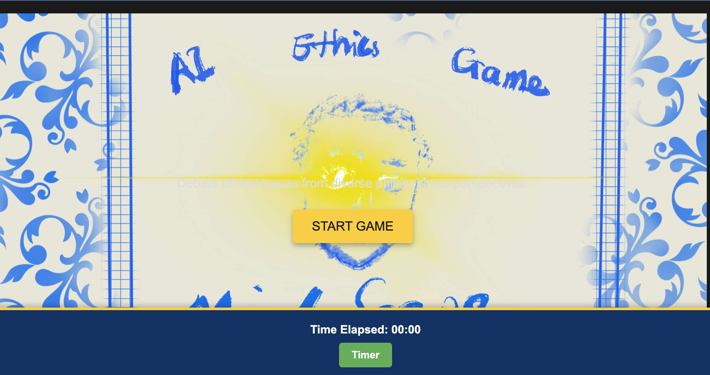
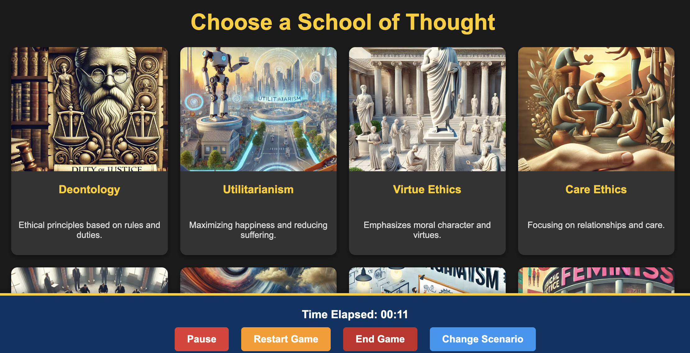
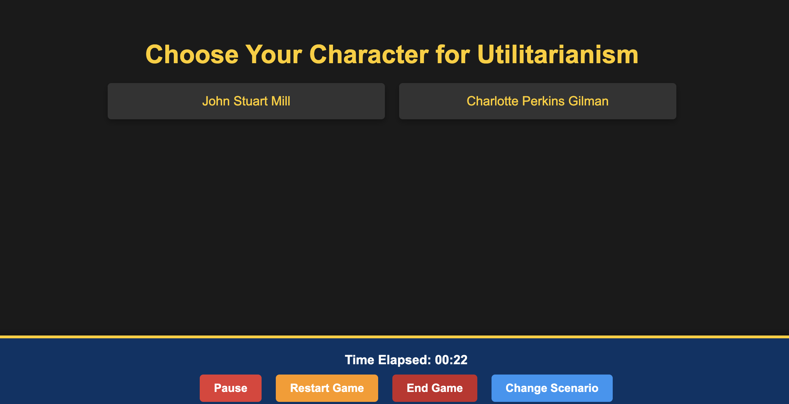
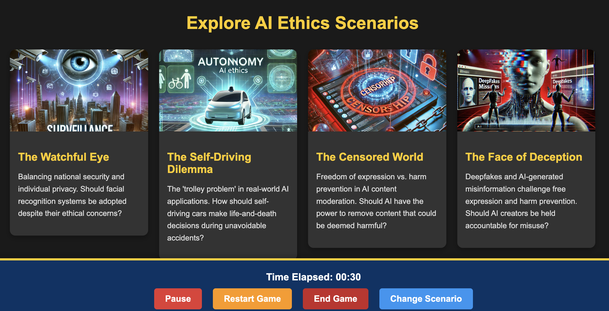
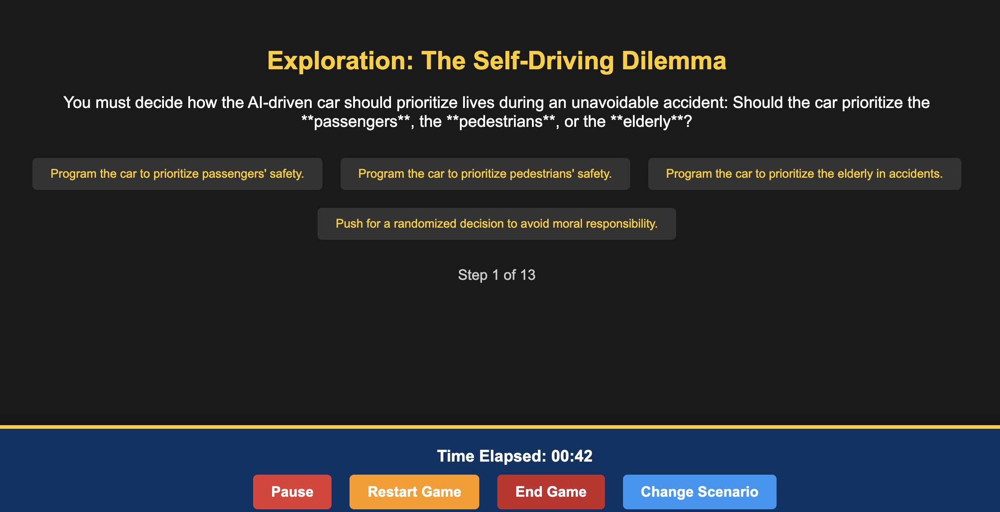
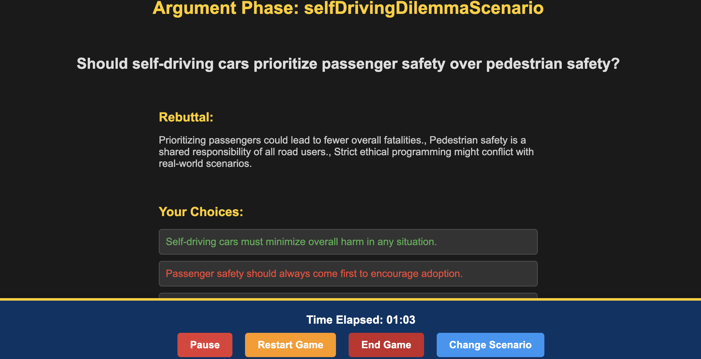
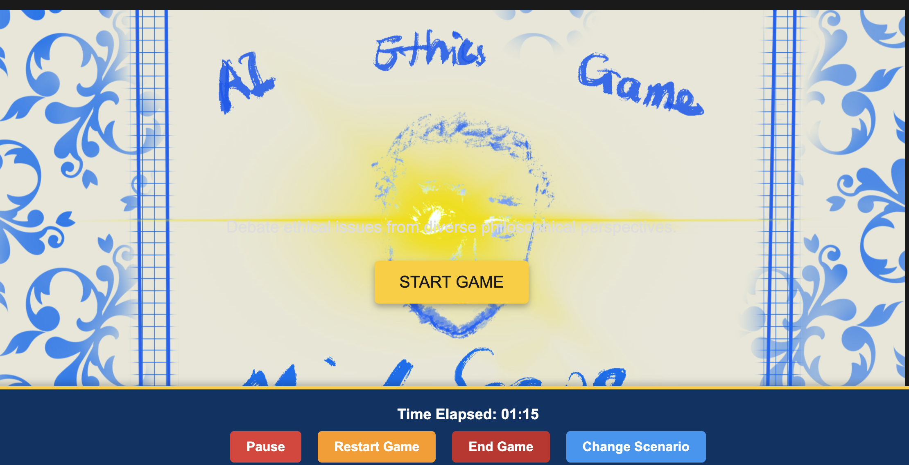

Here’s the complete updated `README.md` file with the illustrated tutorial and updated content:

---

# MindScape: AI Ethics Game

**MindScape** is a visual and interactive game designed to teach players about the ethical implications of Artificial Intelligence. Players choose a school of thought, a philosopher character, and engage in scenario-based argumentation battles. Points are earned through presenting arguments and counterarguments, progressing through different phases of the game.

**Publicly available as a web application**:
   Navigate to [https://mindscape-ai-ethics-games.vercel.app](https://mindscape-ai-ethics-games.vercel.app).

---

## Features

- **Dynamic School of Thought Selection**: Players choose from various philosophical schools of thought.
- **Character Customization**: Select a character representing a specific school of thought.
- **Scenario Exploration**: Navigate ethical scenarios in AI, such as autonomous driving and health applications.
- **Argument Phase**: Engage in debates with opponents from other schools of thought.
- **Round Outcomes and Progression**: Earn points, advance to new opponents, and explore diverse perspectives.
- **Immersive Visuals and Audio**: Images and sounds for an engaging learning experience.

---

## Illustrated Game Tutorial

1. 
   **Start the game by clicking on the yellow button.**

2. 
   **Select your preferred ethical theory.**

3. 
   **Choose your favorite philosopher.**

4. 
   **Choose a scenario you would like to explore.**

5. 
   **Start the Exploration Phase.**

6. 
   **Begin the Argumentation Phase.**

7. 
   **Lose: Learn from your mistakes and try again!**

8. 
   **Win: Your arguments prevailed, and you achieved victory!**

---

## Game Flow

1. **Start Screen**:
   - Players are welcomed to the game and introduced to its purpose.
   - Navigation to the next phase starts here.

2. **School of Thought Selection**:
   - Players choose a school of thought (e.g., Utilitarianism, Deontology, etc.).
   - The selection determines the character options available next.

3. **Character Selection**:
   - Players select a philosopher or character that represents their chosen school of thought.
   - Each character has a brief introduction explaining their philosophy.

4. **Scenario Selection**:
   - Players choose a scenario (e.g., autonomous driving, healthcare AI) to explore.
   - Scenarios are presented as cards with brief descriptions.

5. **Exploration Phase**:
   - Players explore the ethical dimensions of the selected scenario.
   - Interactive decision trees or trivia challenges provide context.

6. **Argument Phase**:
   - Players debate against an opponent representing a different school of thought.
   - Arguments and counterarguments are presented visually.

7. **Round Outcome**:
   - Players receive feedback on their performance and earn points based on the strength of their arguments.
   - Progression to the next opponent or scenario is based on the outcome.

8. **End Game**:
   - Players reach the conclusion of the game, where their total points and performance are summarised.
   - Reflections on ethical implications and learnings are presented.

---

## Additional Links

- **Game Video Demo**: [Watch Demo](https://youtu.be/8vpyzvUP5g4)
- **Game Public URL**: [Play Game](https://mindscape-ai-ethics-games.vercel.app)
- **Game Open Source Code**: [View Repository](https://github.com/Sagaustus/ai-ethics-games)

---

## Technologies Used

- **Frontend**: React, Next.js
- **Styling**: Tailwind CSS
- **State Management**: Custom state management using TypeScript utilities
- **Assets**: Cloudinary for images and Heroku for hosting

---

## Installation and Setup

1. **Clone the repository**:
   ```bash
   git clone https://github.com/Sagaustus/ai-ethics-games.git
   cd ai-ethics-games
   ```

2. **Install dependencies**:
   ```bash
   npm install
   ```

3. **Run the development server**:
   ```bash
   npm run dev
   ```

4. **Open the app in your browser**:
   Navigate to [http://localhost:3000](http://localhost:3000).

---

## Usage

- Navigate through the start screen to select a school of thought and character.
- Explore ethical scenarios and make decisions.
- Engage in debates to defend your chosen school of thought.
- Progress through levels and unlock new scenarios.

---

## Contributing

Contributions are welcome! Please submit a pull request or open an issue to discuss changes.

---

## License

This project is licensed under the MIT License. See the `LICENSE` file for details. 

---

## Acknowledgements

Special thanks to Prof Geoffrey Rockwell, whose AI Ethics Bowl and course content inspired the ethical dilemmas and debates within the game. 

--- 

This `README.md` ensures an easy onboarding experience for new users and contributors while providing a clear, visual guide to the game's functionality. Let me know if there are further details to include!